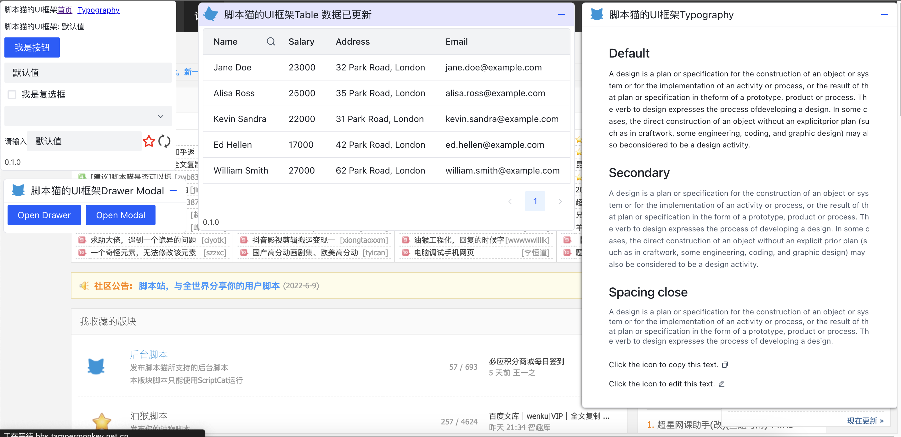

# 脚本猫 UI 库

这是一个类 react 语法适用于油猴脚本的 UI 库，底层基于[React](https://react.dev/)和[Arco](https://arco.design/)。

帮助你**快速**构建一个**美观**且**不会影响页面**的 UI 面板。



## 使用方式

首先你需要在油猴脚本中[`@require`](https://docs.scriptcat.org/docs/dev/meta/#require)本库，链接已发布在脚本站中：[脚本猫 UI 库](https://scriptcat.org/script-show-page/1167)

例如下面这样：

```js
// ==UserScript==
// @name        脚本猫UI库
// @namespace   https://scriptcat.org/
// @description 基于Arco做的UI库, 用于快速开发脚本的UI界面
// @version     0.1.0
// @author      You
// @match       https://bbs.tampermonkey.net.cn/
// @require https://scriptcat.org/lib/1167/1.0.0/%E8%84%9A%E6%9C%AC%E7%8C%ABUI%E5%BA%93.js
// ==/UserScript==
```

另外 UI 库支持两种使用方式，`函数模式`与`JSX模式`。

### 函数模式

函数模式使用 js 的方式编写组件进行使用

[示例](../../example/ui.user.js)

### JSX 模式

jsx 模式需要将组件写为 JSX 的字符串模式

[示例](../../example/ast.user.js)

## 组件

本框架是基于[Arco](https://arco.design/)，你可以在他的官网上看组件相关的文档，调用方式和参数几乎一致，你也可以查看示例来学习如何使用。
